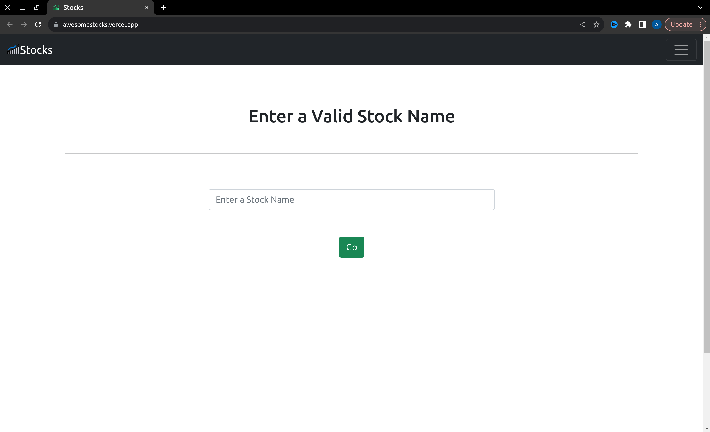

# stocks:
 A sleek Django site for viewing stock data, deployed on Vercel for smooth performance.

## 📦 Tech Stack:

- [Django](https://www.djangoproject.com/)  - Django makes it easier to build better web apps more quickly and with less code.
- [Bootstrap](https://getbootstrap.com/)  - Build fast, responsive sites with Bootstrap.
- [Vercel](https://vercel.com/)  - Vercel's Front end Cloud provides the developer experience and infrastructure to build, scale, and secure a faster, more personalised Web.

## Demo:

<a href="https://awesomestocks.vercel.app/">

</a>


## Getting Started: 

- Clone repository 

```bash
mkdir ~/Dev/stocks -p
cd ~/Dev/stocks
git clone https://github.com/Arvind-4/Stocks.git .
```  

- Install Dependencies:

```bash
cd ~/Dev/stocks
python3.9 -m pip install virtualenv
python3.9 -m virtualenv . 
source bin/activate
pip install -r requirements.txt
```

- Run Server:

```bash
cd ~/Dev/stocks
python manage.py runserver
```

Open [localhost:8000](http://localhost:8000) in your favourite browser :)
